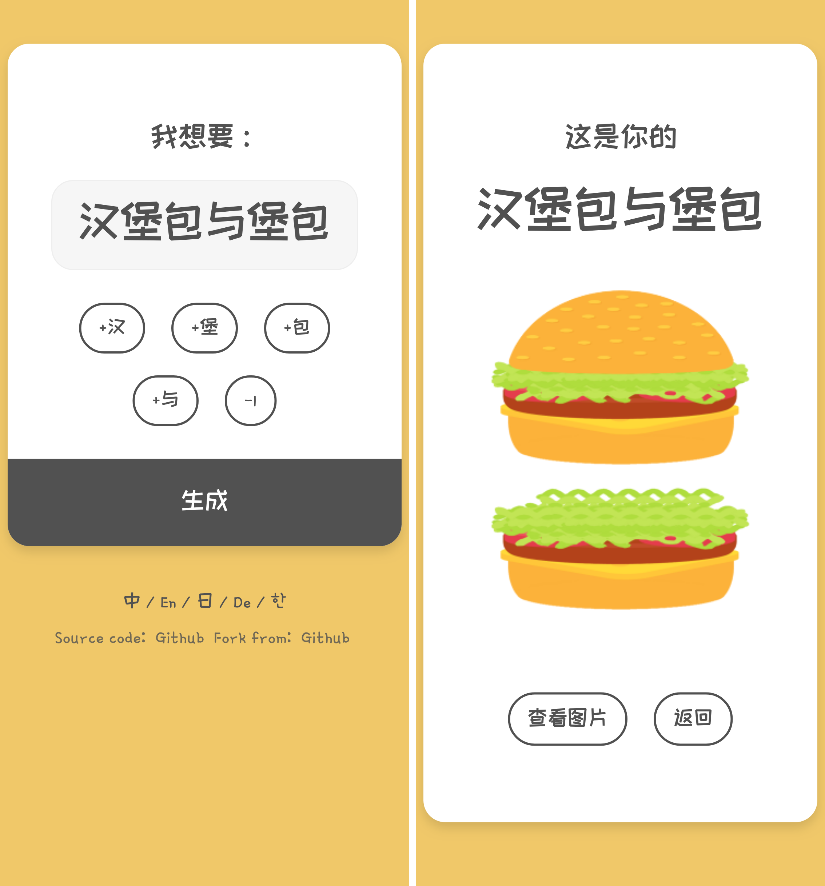

# HAMBURGERBURGER!

Is this your Hamburgerburger?
这是你的汉堡包堡包吗？

[Demo](https://vigorouspro.github.io/hamburgerburger)

## Keyboard shortcuts

| Key       | Description             |
| --------- | ----------------------- |
| h / b / g | Input 'H' or 'B' or 'G' |
| - / Space | Input space             |
| Enter     | Generate                |
| Backspace | Back                    |

## Contributing a translation

The text in Hamburger is in Chinese by default. You can translate it in your language. Just edit your language pack in `assets/js/hamburger.js` and `pull requests` to me. Thanks!

## License

© MIT

## Forked from

[ddiu8081/oreooo](https://github.com/ddiu8081/oreooo)
